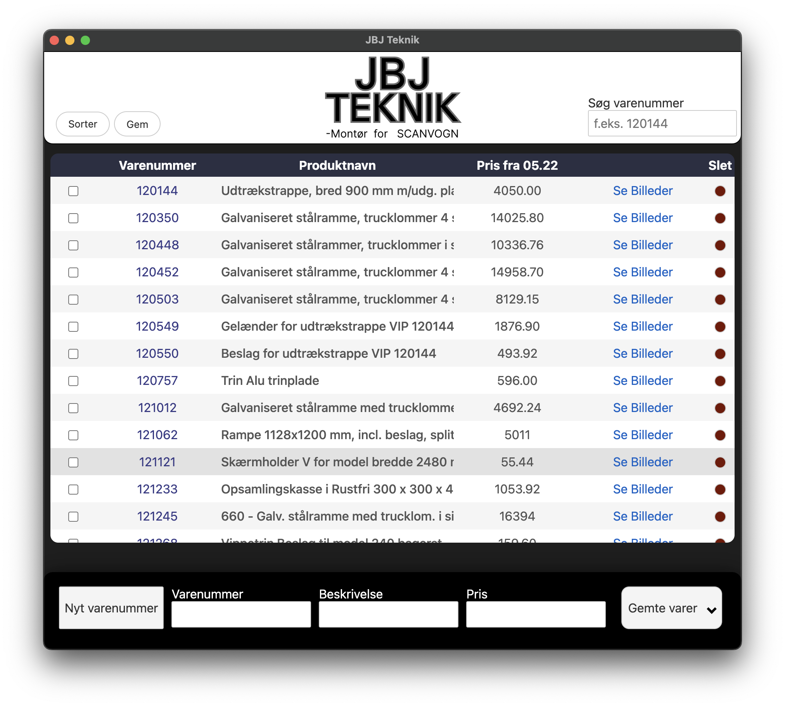
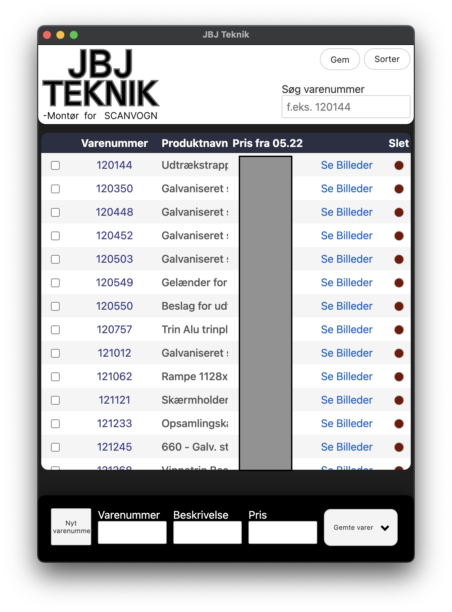

# JBJ Indexer
A simple Electron product overview with search and files.
this was a project i created for JBJTeknik, also my first electron app, of course powered by Svelte, and rollup.

## What it looks like

  
  

## What can it do why was it built?
It has a simple and elegant UI, maybe not the best implemented search bar, a collapsible "saved products" etc. it has room for improvement, but it was essentially built over half a month to aid in writing invoices for products that they provided, and since electron is a chromium browser, it is simple to open files in a new window since chrome supports pdf, image and video previews.
